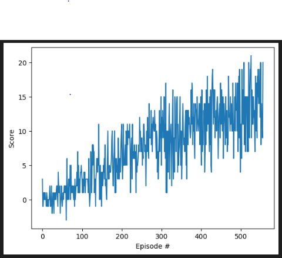
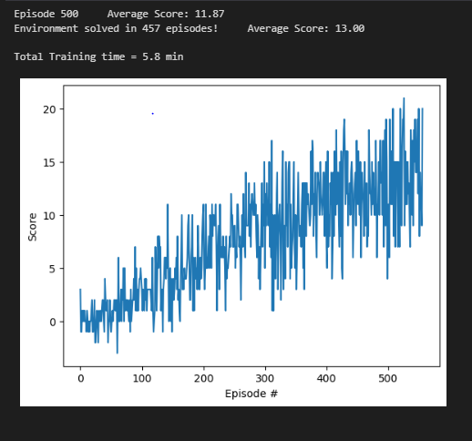

# Banana Collector Agent

## Project's goal

In this project, **the goal is to train an agent to navigate a virtual world and collect as many yellow bananas as possible while avoiding blue bananas**


## Environment details

The environment is [Unity ML-agents](https://github.com/Unity-Technologies/ml-agents) banana collector.


Agents can be trained using reinforcement learning through a simple-to-use Python API. 

Reward = +1  -- for collecting yellow banana 
Reward = -1 -- for collecting blue banana
Hence, the goal is to collect as many yellow bananas as possible.

The state space has 37 dimensions and contains the agent's velocity, along with ray-based perception of objects around the agent's forward direction. 

Given this information, the agent has to learn how to best select actions. 
Four discrete actions are available, corresponding to:

- 0 - move forward.
- 1 - move backward.
- 2 - turn left.
- 3 - turn right.

The task is episodic, and **in order to solve the environment, the agent must get an average score of +13 over 100 consecutive episodes.**


## Agent Implementation

### Deep Q-Networks

This project implements a *Value Based* method called [Deep Q-Networks](https://deepmind.com/research/dqn/). 

Deep Q Learning combines 2 approaches :
- A Reinforcement Learning method called [Q Learning](https://en.wikipedia.org/wiki/Q-learning) (aka SARSA max)
- A Deep Neural Network to learn a Q-table approximation (action-values)


### Code implementation

The code used here is derived from the "Lunar Lander" tutorial from the [Deep Reinforcement Learning Nanodegree](https://www.udacity.com/course/deep-reinforcement-learning-nanodegree--nd893), and has been slightly adjusted for being used with the banana environment.

The code consist of :

- model.py : In this python file, a PyTorch QNetwork class is implemented. This is a regular fully connected Deep Neural Network. This network will be trained to predict the action to perform depending on the environment observed states. This Neural Network is used by the DQN agent and is composed of :
  - the input layer which size depends of the state_size parameter passed in the constructor
  - 2 hidden fully connected layers of 64 cells each
  - the output layer which size depends of the action_size parameter passed in the constructor
- dqn_agent.py : In this python file, a DQN agent and a Replay Buffer memory used by the DQN agent) are defined.
  - The DQN agent class is implemented, as described in the Deep Q-Learning algorithm. It provides several methods :
    - constructor : 
      - Initialize the memory buffer (*Replay Buffer*)
      - Initialize 2 instance of the Neural Network : the *target* network and the *local* network
    - step() : 
      - Allows to store a step taken by the agent (state, action, reward, next_state, done) in the Replay Buffer/Memory
      - Every 4 steps (and if their are enough samples available in the Replay Buffer), update the *target* network weights with the current weight values from the *local* network (That's part of the Fixed Q Targets technique)
    - act() which returns actions for the given state as per current policy (Note : The action selection use an Epsilon-greedy selection so that to balance between *exploration* and *exploitation* for the Q Learning)
    - learn() which update the Neural Network value parameters using given batch of experiences from the Replay Buffer. 
    - soft_update() is called by learn() to softly updates the value from the *target* Neural Network from the *local* network weights (That's part of the Fixed Q Targets technique)
  - The ReplayBuffer class implements a fixed-size buffer to store experience tuples  (state, action, reward, next_state, done) 
    - add() allows to add an experience step to the memory
    - sample() allows to randomly sample a batch of experience steps for the learning       
- DQN_Banana_Navigation.ipynb : This Jupyter notebooks allows to train the agent. More in details it allows to :
  - Import the Necessary Packages 
  - Examine the State and Action Spaces
  - Take Random Actions in the Environment (No display)
  - Train an agent using DQN
  - Plot the scores

### DQN parameters and results

The DQN agent uses the following parameters values (defined in dqn_agent.py)

```
BUFFER_SIZE = int(1e5)  # replay buffer size
BATCH_SIZE = 64         # minibatch size 
GAMMA = 0.995           # discount factor 
TAU = 1e-3              # for soft update of target parameters
LR = 5e-4               # learning rate 
UPDATE_EVERY = 4        # how often to update the network
```

The Neural Networks use the following architecture :

```
Input nodes (37) -> Fully Connected Layer (64 nodes, Relu activation) -> Fully Connected Layer (1024 nodes, Relu activation) -> Ouput nodes (4)
```

The Neural Networks use the zero grad optimizer with a learning rate LR=5e-4 and are trained using a BATCH_SIZE=64

Given the chosen architecture and parameters, our results are :





**These results meets the project's expectation as the agent is able to receive an average reward (over 100 episodes) of at least 13, and in 497 episodes only** (In comparison, according to Udacity's solution code for the project, their agent was benchmarked to be able to solve the project in fewer than 1800 episodes)


